# Citrea Node Types

Citrea operates with four distinct types of nodes, each serving a specific purpose in the network. This document explains the role and responsibilities of each node type.

## 1. Sequencer Node

The Sequencer is responsible for:
- Processing and ordering L2 transactions
- Batching transactions into L2 blocks
- Creating commitments of the L2 state
- Publishing these commitments to the Data Availability (DA) layer
- Managing the transaction mempool
- Maintaining the sequence of L2 blocks

Key characteristics:
- Acts as the primary transaction processor
- Ensures transaction ordering and finality
- Interacts directly with the DA layer
- Manages the state progression of the L2 chain

## 2. Full Node

The Full Node is responsible for:
- Maintaining a complete copy of the L2 state
- Verifying all transactions and state transitions
- Following and validating the sequencer's commitments
- Verifying and processing batch proofs from the Batch Prover
- Providing RPC endpoints for users to interact with the network
- Syncing and validating the entire chain history

Key characteristics:
- Independent verification of all chain data
- Validates both sequencer commitments and batch proofs
- No transaction ordering responsibilities
- Provides data access points for users and applications

## 3. Batch Prover

The Batch Prover is responsible for:
- Generating zero-knowledge proofs for batches of transactions
- Validating state transitions cryptographically
- Processing sequencer commitments
- Creating verifiable proofs of L2 state updates
- Publishing proof transactions to the DA layer

Key characteristics:
- Computationally intensive role
- Creates cryptographic proofs of state validity
- Works in conjunction with the sequencer's commitments

## 4. Light Client Prover

The Light Client Prover is responsible for:
- Processing batch proofs from the Batch Prover
- Generating light client-friendly proofs
- Creating compact proofs for efficient verification
- Enabling lightweight chain verification
- Managing the verification of state transitions for light clients

Key characteristics:
- Creates optimized proofs for resource-constrained clients
- Processes and verifies batch proofs
- Enables efficient chain verification without full state
- Processes L1 blocks sequentially using recursive proof generation
- Enables verification of the latest Citrea rollup state through a single recursive proof

## Interaction Flow

The typical flow of data and verification in the Citrea network:

1. Sequencer processes transactions and creates commitments
2. Full Node validates and syncs these commitments
3. Batch Prover generates ZK proofs of state transitions
4. Full Nodes verify and process these ZK proofs
5. Light Client Prover creates compact proofs for light clients

```mermaid
flowchart LR
    subgraph Clients
        U((Users/Apps))
    end

    subgraph Core
        direction TB
        S[Sequencer]
        FN[Full Node]
        BP[Batch Prover]
        LCP[Light Client Prover]
    end

    subgraph DA
        BTC[Bitcoin Network]
    end

    subgraph Light
        LC[Light Clients]
    end

    %% User interactions
    U -->|Submit Tx| S
    FN -->|Serve Data| U

    %% L2 Block syncing
    S -.->|Sync L2 Blocks| FN & BP

    %% Bitcoin Network interactions
    S -->|Publish Commitments| BTC
    BTC -->|Sync Commitments| FN
    BTC -->|Read Commitments| BP
    BP -->|Publish ZK Proofs| BTC
    BTC -->|Verify ZK Proofs| FN
    BTC -->|Read Blocks & Verify Relations| LCP

    %% Light Client interactions
    LCP -->|Generate Proofs| LC

    %% Styling
    classDef default fill:#0F1117,stroke:#333,stroke-width:2px;
    classDef client fill:#2A2E37,stroke:#333;
    classDef bitcoin fill:#2A2E37,stroke:#F7931A,stroke-width:3px;
    class U,LC client;
    class BTC bitcoin;
```

